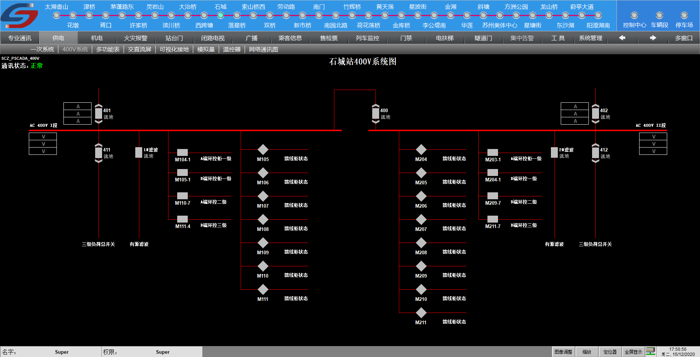
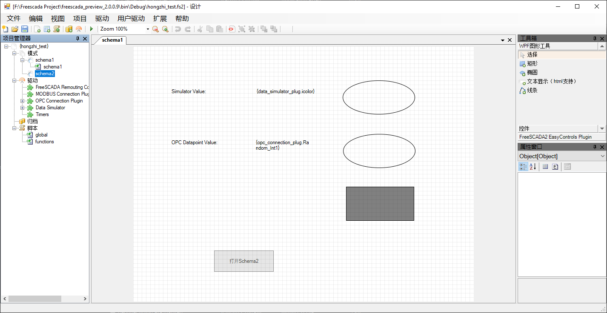
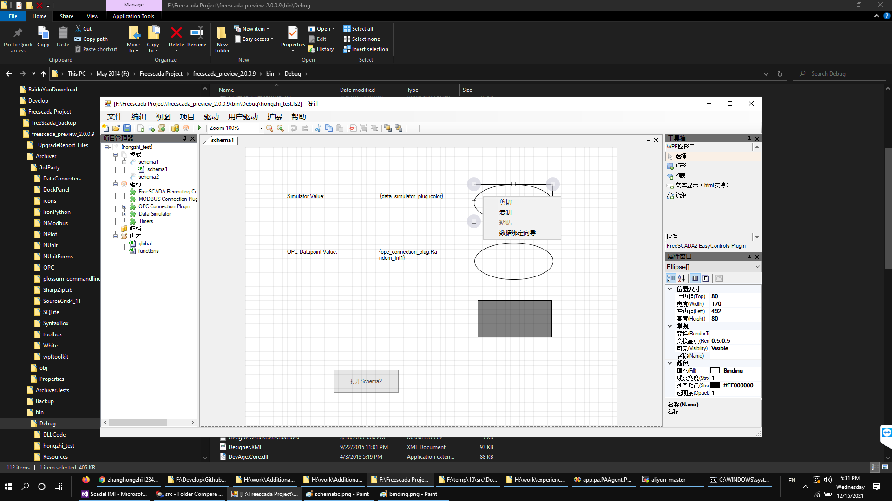
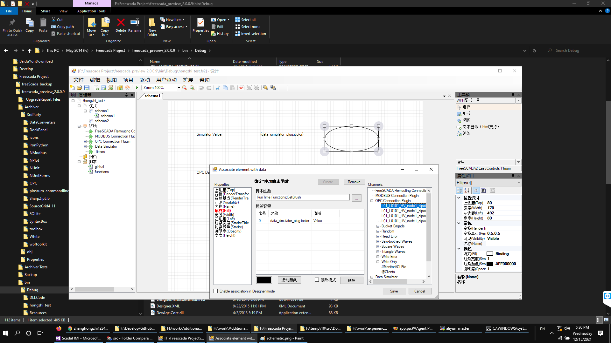
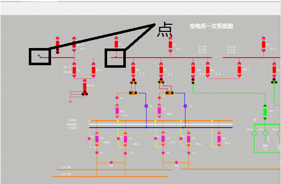

# SCADA-HMI
This software is a SCADA(Supervisory Control and Data Acquisition) HMI(Human Mmachine Interface), its purpose is to replace GraphWorX in our project, becuase Iconics software is not free. The new HMI software can create industrial monitor and control interface for millions of devices. It support several commonly used industrial protocols, such as Modbus, OPC, and can be extended seamless in future.  

Below is a sample of schematic graph drawed by HMI, This graph provide real-time monitoring of all power line and power device:  

## Advantage
This HMI has powerful functions, very compact architecture, no installation, supports Modbus and OPC communication protocols, open architecture, supports C# scripts, can plugin extensions, and is a small and medium-sized system, especially suitable for the configuration and management combined system, this HMI provides customized development and source code services, 

## OS Environment
This HMI supports WindowsXP SP3, Windows2003, Windows7, Windows 10 and higher versions of Windows.

# Sub-project description:

1. Archiver
    + Archive channel to databases
2. CLServer
    + Command line server
3. Common
    + Base class and common libraryy for the project
4. Communication.CLServer
    + CLServer plugin for datasource
5. Communication.MODBUSPlug
    + Modbus plugin for datasource
6. Communication.OPCPlug
    + OPC plugin for datasource
7. Communication.SimulatorPlug
    + Simulator plugin for datasource
8. Communication.Timers
    + Timer plugin for datasource
9. Designer
    + Main Application for HMI design
9. RunTime
    + Run saved HMI in product environment

# Functions
## Graphical basis

The drawing environment uses WPF technology, which is a graphics system based on XAML text language description.

The images are all described in XML language, and the user can modify the source file to achieve special functions or when the configuration is wrong.

Modify the source file when it is wrong.

Graphic objects have some basic attributes, and basic attributes cover almost all graphic objects.

 No. | Name | Data Type | Description
----|----|----|----
1 | Left | Double | Left Margin
2 | Top | Double | Top margin
3 | Height | Double | Height
4 | Width | Double | Width
5 | Name | String | The name of the programming object (runtime binding)
6 | Opatity | Double | Transparency (0-1) 1: Opaque
7 | ToolTip | String | Text prompt when the cursor is moved to the object
8 | Background | Brush | background color
9 | Focusablue | Boolean | Whether there is keyboard focus
10 | IsEnable | Boolean | Whether to allow operation control
11 | Visibility | Boolean | Visible
12 | RenderTransformOrigin | Point | Rendering base point (0.5, 0.5 as the center point)
13 | Stroke | Brush | brush
14 | Foreground | Brush | foreground color
15 | ZIndex | Int | layer, the larger the number, the more forward the display

## Designer GUI
### Overview
  
【File】Menu

"New Project" menu item: Create a blank project

"Open project" menu item: open a project file

"Save Project" menu item: save the current project

"Save project as" menu item: save current project as

"Clear File List" menu item: Clear "History File" under the File menu

"Exit" menu item: Exit the configuration environment

【Edit】menu

Open the graphics editor, the editing menu is effective, most of the editing menus appear on the toolbar.

"Undo" menu item: undo the last operation

"Redo" menu item: redo the last operation

"Cut" menu item: delete the selected content and copy it to the system clipboard

"Copy" menu item: copy the selected content to the system clipboard

"Paste" menu item: paste objects from the system clipboard, support HMI controls, standard text and graphics

Object paste (for example, text copied in Word can be pasted into graphics, and graphics copied on screen can be

Paste into the graphic)

"Group" menu item: group of selected objects

"Ungroup" menu item: break up the selected group

"Left Alignment" menu item: align the selected object to the left

"Align Top" menu item: align the selected object on top

"Right align" menu item: align the selected object to the right

"Align Bottom" menu item: align the selected object below

"Horizontal alignment" menu item: select horizontal alignment of objects

"Vertical alignment" menu item: select the vertical alignment of the object

"Equal width" menu item: select the same width of the object

"Equal height" menu item: select the same height of the object

"Move to front" menu item: move the selected object to the front

"Move to back" menu item: move the selected object to the back

"Rotate" menu item: rotate the selected object

"Binding Data Wizard" menu item: Display the dynamic binding dialog box

【Display】Menu

"Toolbar" menu item: show and hide the toolbar

"Project Manager" menu item: show and hide the Project Manager

"Attribute Editor" menu item: show and hide the attribute editor

"Graphics tool" menu item: show and hide graphic tools

"Status Bar" menu item: show and hide the status bar

"Run System" menu item: Start Runtime runtime environment

"Server Run" menu item: Start Server server environment

"Playback Client" menu item: start playback client

Press "Edit" to open the configuration environment directly.

"User-defined" menu item: display the definition of the drawing system
 
"Zoom out" menu item: view zoom out

"Zoom in" menu item: view zoom

"Lock" menu item: lock the selected object, the locked object cannot be selected by clicking the mouse (using the right mouse button)

Key can)

"Unlock" menu item: unlock the selected object

"XAML Browser" menu item: display the XAML code of the graphic file

"Save xaml file" menu item: save the current graphics file as XAML file

"Import Graphics" menu item: Import user controls (customized XAML files)

### DataSource Import
The HMI will automatically find the plugin dll and show it in "Diver" menu group, below is opc dirver setting:  

Operator can import Opc datasource, Add/Remove datapoints here.
### Data Binding
Data Binding can provide Graphic animation configuration. Right-click on the graphic object in the graphic configuration window, click "Binding Data Wizard" (or double-click the graphic object)  

Open the animation binding window.  

This Dialog will map attribute of selected object to the datasource by the rule, operator can create rules here, usually include direct mapping, threshold mapping or simple scripts.
# Designer Architecture

# Complex Schematic
We use it to draw many complex schematics graphs, below is the power station house graph created by this HMI:

# Performance
Performance is very important indicator for HMI, as the test result we conducted, this HMI can support up to 20000 datapoints refresh mapping at the same time for single schematic page. This is enough, and in real environment, it is not proper to draw so much datapoint at single page, split to multiple pages better, which can balance the load.

# License
This software is a private software, only for demo purpose here, any download is not allowed.